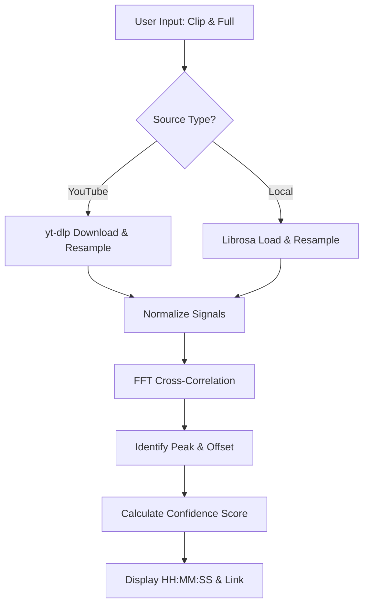

# Audio Timestamp Finder: Technical Walkthrough

This document explains the internal logic and mathematical principles behind how the application finds the exact starting point of a short audio clip within a larger recording.

## 🚀 High-Level Workflow

The application follows a four-stage process to locate the timestamp:

1.  **Audio Acquisition**: Retrieving the audio from either a local file or YouTube.
2.  **Preprocessing**: Normalizing the audio format to ensure mathematical compatibility.
3.  **Signal Matching**: Using FFT cross-correlation to find the best statistical match.
4.  **Result Verification**: Calculating a confidence score and mapping the match to a human-readable timestamp.

---

## 1. Audio Acquisition & Preprocessing

To ensure consistent results regardless of the source, all audio is standardized.

### Standardization Parameters
- **Sample Rate**: 16,000 Hz (16 kHz)
- **Channels**: Mono (1 channel)
- **Format**: Floating-point numpy arrays

### YouTube Processing
When a YouTube URL is used, the `download_youtube_audio` function invokes `yt-dlp` with specific `ffmpeg` post-processor arguments to downsample the stream on the fly. This avoids loading massive, high-bitrate files into memory.

```python
# From app.py: Standardizing the audio stream
f"ffmpeg:-ar {SAMPLE_RATE} -ac 1 -b:a 128k"
```

---

## 2. The Core Algorithm: `find_offset`

The heavy lifting is performed by standard signal processing techniques using `numpy` and `scipy`.

### Step A: Normalization
Before comparing signals, we normalize both the `full_audio` and the `clip`. This ensures that volume differences (e.g., a quiet YouTube stream vs. a loud local clip) do not negatively impact the correlation calculation.

```python
full_audio = full_audio / (np.max(np.abs(full_audio)) + 1e-9)
clip = clip / (np.max(np.abs(clip)) + 1e-9)
```

### Step B: FFT Cross-Correlation
Instead of a "sliding window" approach (which is extremely slow for long audio), we use **Fast Fourier Transform (FFT) Convolution**.

> [!TIP]
> Cross-correlation in the time domain is equivalent to multiplication in the frequency domain. By using `fftconvolve` and reversing the clip, we compute the relationship between the two signals across all possible shifts simultaneously.

```python
# The mathematical core
correlation = fftconvolve(full_audio, clip[::-1], mode="full")
peak_index = np.argmax(np.abs(correlation))
```

The peak in the resulting `correlation` array represents the point in time where the two signals are most similar (statistically aligned).

---

## 3. Confidence Calculation

To prevent "false positives" (matching silence or random noise), the app calculates a confidence percentage.

The raw correlation peak is divided by the combined energy of both signals.
- **100%**: An identical match.
- **>20%**: Usually a very strong, reliable match.
- **>10%**: Likely a match, but check for noise.
- **<5%**: Likely a mismatch.

---

## 4. Search Windows & Optimization

Searching through a multi-hour stream is memory-intensive. To keep the app fast and stable:

- **30-Minute Windows**: The app only searches a 30-minute slice starting from your specified `window_start_input`.
- **Caching**: The "Full Audio" is cached in the Streamlit `session_state`. If you change the search window and click "Find" again, the app does **not** re-download or re-load the audio from disk; it simply re-slices the existing memory buffer.

---

## 🔍 Visual Summary of Logic



> [!IMPORTANT]
> **Why 16kHz?**
> We use 16kHz because it captures the frequency range of human speech perfectly while reducing the number of data points by 66% compared to standard 44.1kHz music audio. This makes the FFT calculation roughly 3x faster and significantly more memory-efficient.
